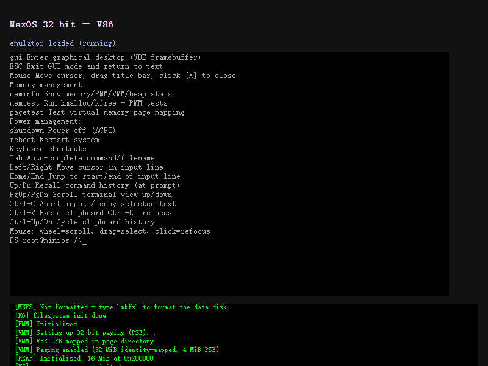

# NexOS 32 位镜像 · V86 浏览器运行

在浏览器里通过 [V86](https://github.com/copy/v86)（x86 模拟器，WASM）启动 NexOS 的 **32 位内核**，
直接进入命令行并执行 `help`。不需要图形界面。



## 快速开始

```bash
cd web/v86

# 1) 获取 V86 运行时文件（libv86.js / v86.wasm / seabios.bin / vgabios.bin）
node fetch-assets.js

# 2) 组装可引导镜像 nexos32.img
node build-image.js

# 3) 起一个静态服务器（WASM 与磁盘镜像不能走 file://）
python3 -m http.server 8000
#   然后浏览 http://127.0.0.1:8000/
```

登录：**用户名 `root`，密码 `admin`**（与 `Makefile` 的 `play:` 目标一致）。
登录后输入 `help` 即可。

## 目录内容

| 文件 | 说明 |
|------|------|
| `index.html` | 页面：加载 BIOS 与磁盘镜像，把 VGA 画面和串口输出接到 DOM |
| `build-image.js` | 组装 `nexos32.img`（4 MiB），逐区校验并写入 MBR 分区表 |
| `patch-image.js` | 按 LBA 精确改写镜像中的某一段（调试用） |
| `fetch-assets.js` | 拉取 V86 运行时文件 |
| `nexos32.img` | 组装产物（4 MiB，由 `build-image.js` 生成，不入版本库） |

## 镜像布局

与 `bootloader/README.md` 一致：

```
LBA 0        boot.bin     Stage 1 引导扇区（512 B，签名 0x55AA）
LBA 1..32    stage2_v86.bin  Stage 2（固定 16 KiB，保证内核 LBA 固定）
LBA 33..     kernel.bin   32 位平坦内核，加载到 0x10000
镜像总长      4 MiB
```

`build-image.js` 还会在 MBR 偏移 446 写入一个覆盖全盘的分区表项：
**V86 依靠分区表推导模拟磁盘的几何参数**（见 V86 的 `get_disk_geometry`），
没有分区表时 BIOS 经 `INT 13h AH=08h` 返回全 0 几何。

## 为了让内核在 V86 下跑起来所做的改动

`bootloader/tools/stage2_v86.asm` 是为 V86 目标准备的 Stage 2，与 `bootloader/stage2.asm`
有三处实质差异，每一处都对应一个已复现的问题：

1. **`int 0x13` 前后保存 `ESI`**
   内核内偏移存在 `ESI`，而 DAP 指针必须放进 `SI`，`INT 13h` 会破坏 `SI`。
   不保存时，第一次读盘之后偏移量就变成了 DAP 的地址，此后的每次读都指向错误的扇区
   ——在 V86 下表现为第二次读盘报 `AH=0x01`，而单独一次读（相同参数）却正常。

2. **每次只读 1 个扇区**（`KERNEL_CHUNK = 1`）
   与上一条同源，改动后读取路径不再依赖跨调用的寄存器状态。
   代价是 512 次 `INT 13h` 调用，启动略慢。

3. **不设置 VBE 图形模式**
   本目标只需要命令行。内核若认为图形模式就绪，会尝试初始化 GUI 并在 V86 下触发 `#GP`，
   而 V86 没有实现 `#GP` 处理，整个模拟器会直接 panic（`Unimplemented: #GP handler`）。

另外 `bootloader/stage2.asm` 中修掉了一个与 V86 无关的真实缺陷：
段步进值原本硬编码为 `0x0800`（只对 64 扇区成立），现改为由 `KERNEL_CHUNK` 推导的
`KERNEL_SEG_STEP`，否则调整分块大小会让内核在加载时自我覆盖。

## 已知限制

- **没有图形界面**：`gui` 命令在 V86 下不可用（`#GP`）。命令行功能正常。
- **没有 SFS 文件系统**：镜像里未包含 `sfs.img`，内核启动时会提示
  `SFS: not found`；命令行基础功能不受影响。
- 启动较慢：512 次单扇区读加上 WASM 模拟，冷启动约 20–40 秒。
